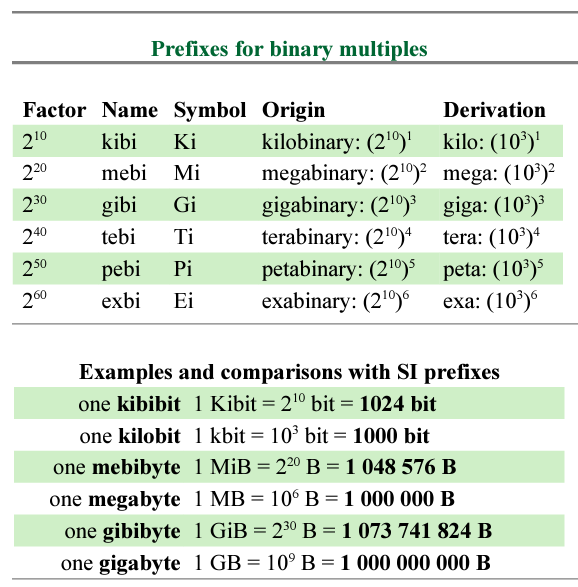

# Montagem e manutenção de computadores

## Sistemas de numeração

O sistema de numeração mais utilizado é o decimal. Ele é composto por dez símbolos ou dígitos: 0, 1, 2, 3, 4, 5, 6, 7, 8 e 9.  Neste sistema, cada dígito representa um valor multiplicado por 10 elevado ao número de casas decimais. Por exemplo, o número 1234 representa: 

```
1 x 10³ = 1000
2 x 10² =  200 
3 x 10¹ =   30
4 x 10⁰ =    4
-----------------
          1234
```
 

O sistema octal é composto por oito símbolos: 0, 1, 2, 3, 4, 5, 6 e 7. Ele é um sistema de numeração em que cada dígito representa um valor multiplicado por 8 elevado ao número de casas decimais. Por exemplo, o número 1234 representa: 

``` 
1 x 8³  = 512 
2 x 8²  = 128 
3 x 8¹  =  24 
4 x 8⁰  =   4
-----------------
(1234o) = 668
```


O sistema hexadecimal é composto por dez símbolos e seis letras: 0, 1, 2, 3, 4, 5, 6, 7, 8, 9, A, B, C, D, E e F. O sistema hexadecimal é um sistema de numeração em que cada dígito representa um valor multiplicado por 16 elevado ao número de casas decimais. Por exemplo, o número 1A2B representa: 

```
(1)  1 x 16³ = 4096 
(A) 10 x 16² = 2560  
(2)  2 x 16¹ =   32 
(B) 11 x 16⁰ =   11
-------------------
(1A2Bh)      = 6699
```

Como os equipamentos eletrônicos relacionados à computação trabalham com os estados "ligado" e "desligado", o sistema binário é o mais utilizado. Ele é composto por dois símbolos: 0 e 1. O 0 representa o "desligado" e o 1 representa o "ligado". Cada dígito representa um valor multiplicado por 2 elevado ao número de casas decimais. Por exemplo, o número 1011 representa: 

```
1 x 2³  =  8
0 x 2²  =  0 
1 x 2¹  =  2 
1 x 2⁰  =  1
-----------------
(1011b) = 11
```

Tabela 1 - Sistemas de numeração

|Sistema|Dígitos|Base|
|:-|:-|:-|
|Decimal|0, 1, 2, 3, 4, 5, 6, 7, 8 e 9|10|
|Octal|0, 1, 2, 3, 4, 5, 6 e 7|8|
|Hexadecimal|0, 1, 2, 3, 4, 5, 6, 7, 8, 9, A, B, C, D, E e F|16|
|Binário|0 e 1|2|

Tabela 2 - Conversão de sistemas de numeração

|Decimal|Octal|Hexadecimal|Binário|
|:-|:-|:-|:-|
|0|0|0|0|
|1|1|1|1|
|2|2|2|10|
|3|3|3|11|
|4|4|4|100|
|5|5|5|101|
|6|6|6|110|
|7|7|7|111|
|8|10|8|1000|
|9|11|9|1001|
|10|12|A|1010|
|11|13|B|1011|
|12|14|C|1100|
|13|15|D|1101|
|14|16|E|1110|
|15|17|F|1111|
|16|20|10|10000|

## Unidades de medida

O sistema internacional de unidades (SI) é um sistema de medidas que foi criado para padronizar as unidades de medida. Ele é composto por sete unidades básicas: metro, quilograma, segundo, ampere, kelvin, candela e mol. A partir destas unidades básicas, são criadas outras unidades de medida, como o litro, o metro quadrado, o metro cúbico, o metro por segundo, o metro por segundo quadrado, o newton, o pascal, o joule, o watt, o volt, o ohm etc.

Figura 1 - Sistema internacional de unidades (SI)


Fonte: [Sistema Internacional de Unidades](https://pt.wikipedia.org/wiki/Sistema_internacional_de_unidades)

Tabela 3 - As 7 constantes fundamentais

|Símbolo|Nome|Quantidade|
|:-|:-|:-|
|m|metro|comprimento|
|kg|quilograma|massa|
|s|segundo|tempo|
|A|ampere|corrente elétrica|
|K|kelvin|temperatura|
|cd|candela|intensidade luminosa|
|mol|mol|quantidade de matéria|

Fonte: Wikipedia Foundation. _Sistema Internacional de Unidades_, disponível em https://pt.wikipedia.org/wiki/Sistema_internacional_de_unidades

Assim sendo, o SI também determinou um sistema de medidas com 20 prefixos.

Tabela 4 - Prefixos do SI

|Prefixo|Símbolo|Fator de multiplicação|Valor|
|:-|:-|:-|:-|
|yotta|Y|10<sup>24</sup>|1.000.000.000.000.000.000.000.000|
|zetta|Z|10<sup>21</sup>|1.000.000.000.000.000.000.000|
|exa|E|10<sup>18</sup>|1.000.000.000.000.000.000|
|peta|P|10<sup>15</sup>|1.000.000.000.000.000|
|tera|T|10<sup>12</sup>|1.000.000.000.000|
|giga|G|10<sup>9</sup>|1.000.000.000|
|mega|M|10<sup>6</sup>|1.000.000|
|quilo|k|10<sup>3</sup>|1.000|
|hecto|h|10<sup>2</sup>|100|
|deca|da|10<sup>1</sup>|10|
|_unidade_|_símbolo base_|1|1|
|deci|d|10<sup>-1</sup>|0,1|
|centi|c|10<sup>-2</sup>|0,01|
|milímetro|mm|10<sup>-3</sup>|0,001|
|micro|μ|10<sup>-6</sup>|0,000,001|
|nano|n|10<sup>-9</sup>|0,000,000,001|
|pico|p|10<sup>-12</sup>|0,000,000,000,001|
|femto|f|10<sup>-15</sup>|0,000,000,000,000,001|
|atto|a|10<sup>-18</sup>|0,000,000,000,000,000,001|
|zepto|z|10<sup>-21</sup>|0,000,000,000,000,000,000,001|
|yocto|y|10<sup>-24</sup>|0,000,000,000,000,000,000,000,001|

Fonte: NIST. _SI Prefixes_, disponível em https://physics.nist.gov/cuu/Units/prefixes.html

As unidades de medida mais utilizadas na computação são: bit, byte, kilobyte, megabyte, gigabyte, terabyte, petabyte, exabyte, zettabyte e yottabyte. A tabela 5 apresenta a relação entre as unidades de medida.

Tabela 5 - Unidades de medida da ISO

|Unidade|Símbolo|Valor|Capacidade em bytes|
|:-|:-|:-|:-|
|Bit|b|1|
|Byte|B|8 bits| 1 byte = 8 bits|
|Kilobyte|KB|1000 bytes| 1 KB = 1000 bytes|
|Megabyte|MB|1000 kilobytes| 1 MB = 1.000.000 bytes|
|Gigabyte|GB|1000 megabytes| 1 GB = 1.000.000.000 bytes|
|Terabyte|TB|1000 gigabytes| 1 TB = 1.000.000.000.000 bytes|
|Petabyte|PB|1000 terabytes| 1 PB = 1.000.000.000.000.000 bytes|
|Exabyte|EB|1000 petabytes|  1 EB = 1.000.000.000.000.000.000 bytes|
|Zettabyte|ZB|1000 exabytes| 1 ZB = 1.000.000.000.000.000.000.000 bytes|
|Yottabyte|YB|1000 zettabytes| 1 YB = 1.000.000.000.000.000.000.000.000 bytes|

> [1]: Para ser ter uma ideia, a [Bíblia Sagrada contém cerca de *3.799.922* caracteres][2], incluíndo espaços e pontuação. Então temos que: 
> * *3.799.922* caracteres = *3.799.922* bytes
> * *3.799.922* bytes = 3.710,86 KiB ou 3.799,92 KB
> * *3.799.922* bytes = 3,623 MiB ou 3,79 MB

[2]: <https://augustomen.wordpress.com/2017/03/01/quantos-versiculos-ha-em-cada-capitulo-da-biblia/> "Quantos versículos há em cada capítulo da Bíblia?" 

_E o que vem a ser MiB?_

MiB ou Mebibyte é uma unidade de medida de informação que representa 2<sup>20</sup> bytes. 

O KiB ou Quibibyte é uma unidade de medida de informação que representa 2<sup>10</sup> bytes.

A diferença entre KiB e KB é que o primeiro é baseado em potências de 2, enquanto o segundo é baseado em potências de 10.

O objetivo é substituir o kB por kiB, pois o quilo ou "kilo" (k) não é uma unidade de medida binária, mas sim decimal. Houve uma certa "confusão" no passado com o uso do termo "kilo" para representar 1024 bytes. Veja um caso real:

> **"HD de 80 giga? Mas só aparecem 74,6 GB! Fui enganado?"**
> 
> "É muito comum encontrar em fóruns e sites usuários com a mesma dúvida: “Por que só aparecem 74,6 GB disponíveis no meu HD se eu comprei um disco de 80 GB?”. Quem nunca teve essa dúvida?
> 
> Bom, a resposta é bem simples. No mundo da informática 1 KB era igual 1024 bytes. Mas, os fabricantes de HDs adotam 1 KB = 1000 bytes."

Fonte: Adaptado de TECMUNDO. _Você usa corretamente as Unidades de Grandeza da informática?_, disponível em https://www.tecmundo.com.br/educacao/2025-voce-usa-corretamente-as-unidades-de-grandeza-da-informatica-.htm. ACessado em 13/03/2023.

Houve casos de usuários que processaram empresas por propaganda enganosa, pois o HD de 80 GB não continha 80 GB, mas sim 74,6 GB. Para evitar esse tipo de problema, a IEC (International Electrotechnical Commission) e a ISO (International Organization for Standardization) criaram a norma IEC 60027-2, que estabelece que 1 KiB = 1024 bytes.

Figura 2 - Prefixos para múltiplos binários 



Fonte: ISO. _IEC 60027-2:2003 - International Electrotechnical Vocabulary - Part 2: Letter symbols to be used in electrical technology - Section 200: Quantities and units_, disponível em https://webstore.iec.ch/preview/info_iec60027-2%7Bed4.0%7Db.pdf. Acessado em 13/03/2023.

A tabela 6 apresenta as unidades de medida conforme a Norma IEC 60027-2.

Tabela 6 - Unidades de medida da Norma IEC 60027-2

|Unidade|Símbolo|Valor|Capacidade em bytes|
|:-|:-|:-|:-|
|Mebibyte|MiB|1024 kibibytes| 1 MiB = 1.048.576 bytes|
|Gibibyte|GiB|1024 mebibytes| 1 GiB = 1.073.741.824 bytes|
|Tebibyte|TiB|1024 gibibytes| 1 TiB = 1.099.511.627.776 bytes|
|Pebibyte|PiB|1024 tebibytes| 1 PiB = 1.125.899.906.842.624 bytes|
|Exbibyte|EiB|1024 pebibytes|  1 EiB = 1.152.921.504.606.846.976 bytes|
|Zebibyte|ZiB|1024 exbibytes| 1 ZiB = 1.180.591.620.717.411.303.424 bytes|
|Yobibyte|YiB|1024 zebibytes| 1 YiB = 1.208.925.819.614.629.174.706.176 bytes|


> Ficou curioso? Veja mais em https://pt.wikipedia.org/wiki/Quibiocteto (Acessado em 13/03/2023).


